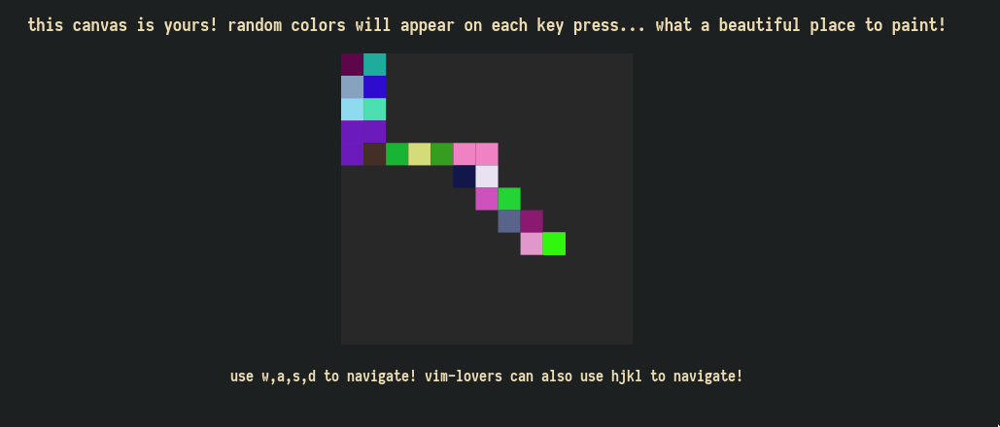

# painter -> vim lover's distractful-reliever!

## why does this freaking exist
i like playing with stupid things such as js canvases, and this is the first thing i created with js canvases. 

## how-to-control
hjkl: `vim-lover vay`

wasd: `gamer way`

## opt-dep if you want to run as a simple server
install optional dependency `http-server`, to run `npm start`

## screenshot

